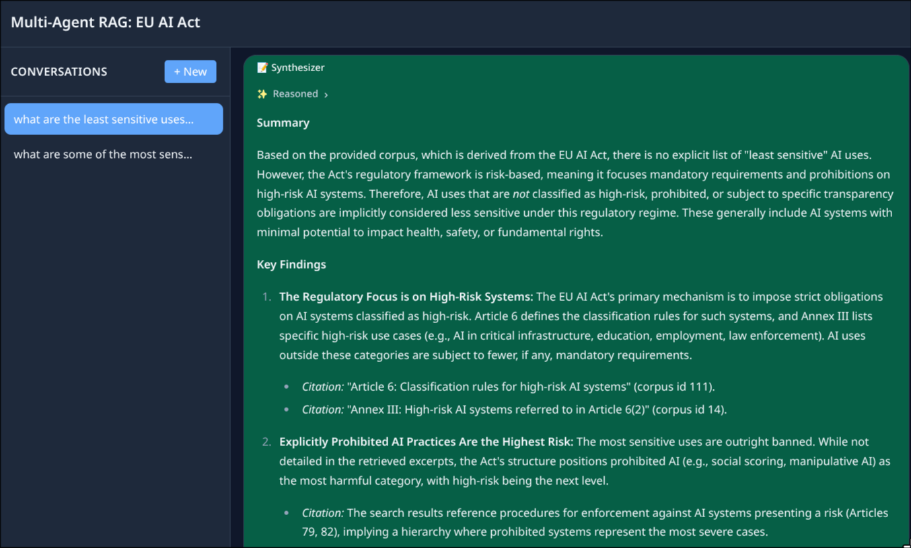

# Multi-Agent RAG

> **Live demo:** [multi-agent-rag.olegedly.com](https://multi-agent-rag.olegedly.com/)
A config-driven multi-agent research system with pgvector RAG, MCP tool servers, and a LangChain agent pipeline. Answers are grounded in curated knowledge bases (corpora), each scoped to a single corpus with route-based isolation.

## Quick Start

First, create your config:

```bash
cp .env.example .env
# Then edit .env with your API keys
```

Then start the dev environment:

```bash
./dev.sh
```

This starts PostgreSQL (Docker), the FastAPI backend (hot-reload on `localhost:8000`), and the SolidJS frontend (Vite HMR on `localhost:3000`). The frontend proxies `/api/*` to the backend.

**Prerequisites:** Docker, `uv` (Python ≥3.13), Bun, pgweb (optional).

## Architecture

```
SolidJS SPA → AG-UI/SSE → FastAPI → LangChain Agent Pipeline
                                        ├── Researcher Agent (corpus-scoped search)
                                        ├── Critic Agent (corpus-scoped verification)
                                        └── Synthesizer Agent (corpus-scoped answer)
                              LangChain RAG Tools (search_corpus, read_document)
                                   └── pgvector RAG (corpus-filtered)
                              MCP Server (standalone, for pi/Claude Desktop)
                                   └── pgvector RAG (corpus-filtered)
```



The system is **corpus-scoped**: each conversation binds to one corpus from start to finish. Every retrieval carries the active `corpus_id`. Adding a new knowledge base is an ingestion + config task.

### Key modules

| Module | Responsibility |
|--------|---------------|
| `backend/embeddings/` | Abstract `EmbeddingClient` protocol with config-driven factory |
| `backend/rag/` | Chunker strategies + pgvector semantic search |
| `backend/mcp_server/` | Standalone MCP server: `search_corpus`, `read_document` |
| `backend/agents/` | LangGraph multi-agent pipeline: Researcher → Critic → Synthesizer |
| `backend/main.py` | FastAPI `create_app()` factory with DI for testing |
| `frontend/src/` | SolidJS SPA with conversation persistence |

## Configuration

Set via `.env`:

| Variable | Purpose |
|----------|---------|
| `LLM_PROVIDER` | `anthropic` or `openai` |
| `LLM_MODEL` | Model name (e.g. `deepseek-chat`, `gpt-4o`) |
| `LLM_API_KEY` | API key |
| `LLM_BASE_URL` | API base URL |
| `EMBEDDING_MODEL` | Embedding model via OpenRouter |
| `POSTGRES_*` | PostgreSQL connection details |

## Adding a Corpus

1. Place documents in `corpora/<slug>/`
2. Add entry to `backend/corpora.yaml` (id, slug, name, chunker strategy, glob)
3. Run `uv run scripts/seed_knowledge_base.py --corpus <slug>`
4. Frontend picks it up from `GET /api/corpora`

## Seeding

```bash
uv run scripts/seed_knowledge_base.py --all       # all corpora
uv run scripts/seed_knowledge_base.py --corpus eu-ai-act  # single corpus
```

Idempotent: SHA-256 diff against `document_sources` table (insert new, update changed, delete removed, skip unchanged).

## Testing

```bash
make test           # full suite (backend + frontend)
make test_backend   # backend only
make test_frontend  # frontend only
```

> All **422 tests pass** (223 backend + 199 frontend) with 0 pyright/TypeScript errors.

Pure unit tests — no Docker or DB dependency for business logic. The `create_app()` DI makes mocking straightforward.

## Deployment

Two Docker images, pushed to GHCR on `main`:
- `ghcr.io/<owner>/multi-agent-rag-be:latest` — FastAPI + LangChain + MCP
- `ghcr.io/<owner>/multi-agent-rag-fe:latest` — Caddy serving the SPA

CI/CD: GitHub Actions → build → push → Coolify webhook.
